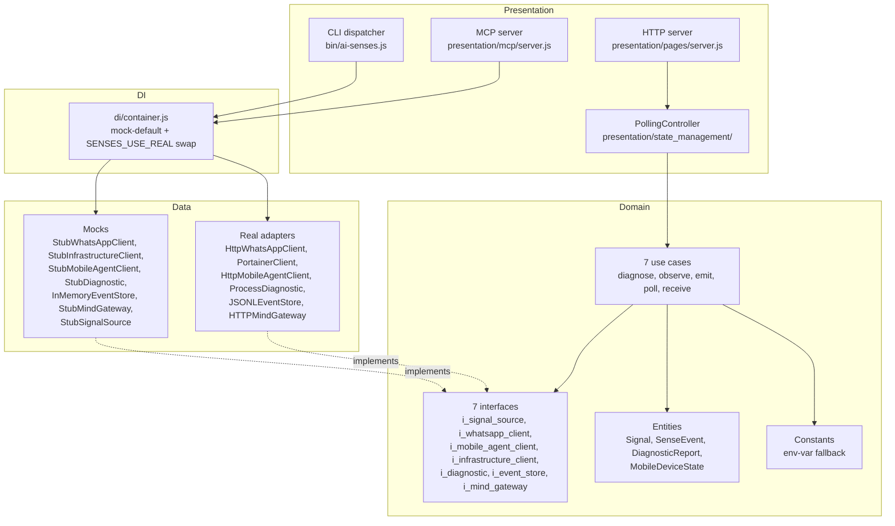
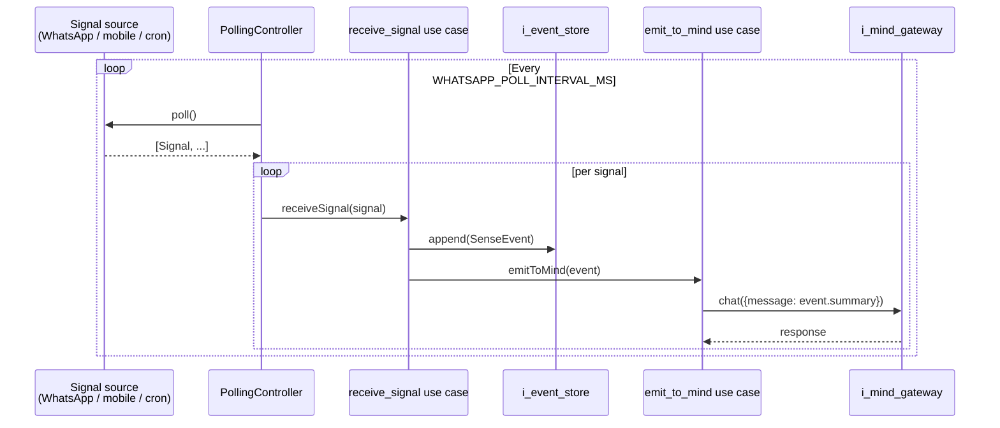
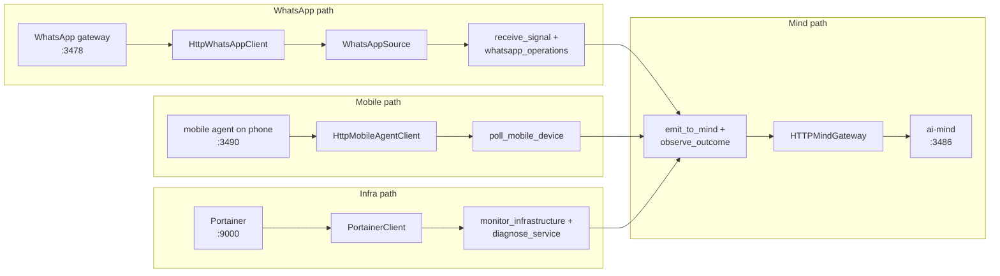

# ARCHITECTURE.md

How ai-senses is structured, where signals come from, what flows through the use cases, and where the mock-vs-real swap happens.

For the why, start with [README.md](README.md). For the formal interface specs, see [CONTRACTS.md](CONTRACTS.md).

---

## 1. Clean architecture layering



The dependency rule: domain has no imports from data or presentation. Data depends on domain (interfaces + entities). Presentation depends on the container, which assembles the rest.

Translated to imports:
- `domain/use_cases/*.js` → `require("../entities/...")`, `require("../repositories/i_*")`
- `data/repositories/*.js` → `require("../../domain/repositories/i_*")`
- `presentation/*.js` → `require("../../di/container")` (never directly into data)

That's the "clean" part. The point is you can swap any data adapter without touching domain code.

---

## 2. Signal flow



**Read it:** the perception loop polls every configured source on a timer. Each raw signal becomes a `SenseEvent` that's persisted to the event store and forwarded to the agent's mind for reasoning. The mind's response — usually a decision like "restart service X" — flows back through `observe_outcome` after a delay to verify the decision actually worked.

---

## 3. Mock vs real swap

```mermaid
flowchart LR
    Env[SENSES_USE_REAL env var<br/>"" / "whatsapp,mobile" / "all"]
    Container[createContainer]
    Decide{For each integration<br/>in KNOWN_KEYS:<br/>is it in useReal?}
    Real[Real adapter<br/>HttpWhatsAppClient, etc.]
    Mock[Stub<br/>StubWhatsAppClient, etc.]
    Bundle[Container bundle<br/>{whatsappClient,<br/>mobileClient,<br/>infraClient,<br/>mindGateway,<br/>diagnostic,<br/>eventStore,<br/>sources}]

    Env --> Container
    Container --> Decide
    Decide -- "yes" --> Real
    Decide -- "no (default)" --> Mock
    Real --> Bundle
    Mock --> Bundle
```

**Seven swap keys:** `whatsapp`, `mobile`, `infrastructure`, `mind`, `diagnostic`, `events`, `signals`.

Default → all seven mocked. Set `SENSES_USE_REAL=mobile,mind` to swap just those two; the rest stay mocked. Set `all` for everything real (this is what raj-sadan does in production).

Why this works: every interface has both a real implementation and a stub. The container picks one or the other per integration. Use cases never know which they got — they only see the interface.

---

## 4. MCP tool surface

```mermaid
flowchart TB
    Claude[Claude Code]
    Cursor[Cursor]
    Codex[Codex]

    subgraph MCP[MCP server / stdio]
        Capture[senses_capture<br/>fetch one round of signals]
        Diagnose[senses_diagnose<br/>port + process check]
        Mobile[senses_mobile_status<br/>battery / location / SMS]
        Send[senses_send_whatsapp<br/>post a message]
    end

    subgraph Container[DI container]
        Sources[sources[]]
        Diag[diagnostic]
        Mob[mobileClient]
        WA[whatsappClient]
    end

    Claude --stdio--> MCP
    Cursor --stdio--> MCP
    Codex --stdio--> MCP

    Capture --> Sources
    Diagnose --> Diag
    Mobile --> Mob
    Send --> WA
```

Four tools. Each one is a thin wrapper around a container method. The agent runner connects via stdio (`ai-senses mcp`) and gets all four tools auto-discovered.

Add a tool: register it in `src/presentation/mcp/server.js` next to the existing four, document it in the README.

---

## 5. Per-integration data flow



Four integration paths converge on `emit_to_mind`. The mind organ is the single point of egress — every sense event ends up there for reasoning.

---

## What's deliberately not here

A few things you might expect to find:

- **Camera / mic capture.** The original raj-sadan senses focuses on infrastructure perception (process state, mobile state, message streams), not hardware capture. Webcam / mic abstractions are out of scope for v0.1.0; they may land in v0.2 if there's demand.
- **Direct service control.** Senses observes and reports; it doesn't restart services itself. The mind decides; senses observes whether the decision worked. This separation is deliberate — keeps the perception layer dumb.
- **Cross-organ orchestration.** Senses talks to mind via one HTTP endpoint. It doesn't know about memory, knowledge, or dashboard. The mind aggregates.

These are tradeoffs. The whole point of clean architecture is that future-you can add any of them without touching the existing layers.

---

## See also

- [README.md](README.md) — what this is, why it exists, how to use it
- [CHANGELOG.md](CHANGELOG.md) — what shipped in v0.1.0
- [`src/di/container.js`](src/di/container.js) — the swap mechanism in code
- [`src/presentation/mcp/server.js`](src/presentation/mcp/server.js) — the four tools
